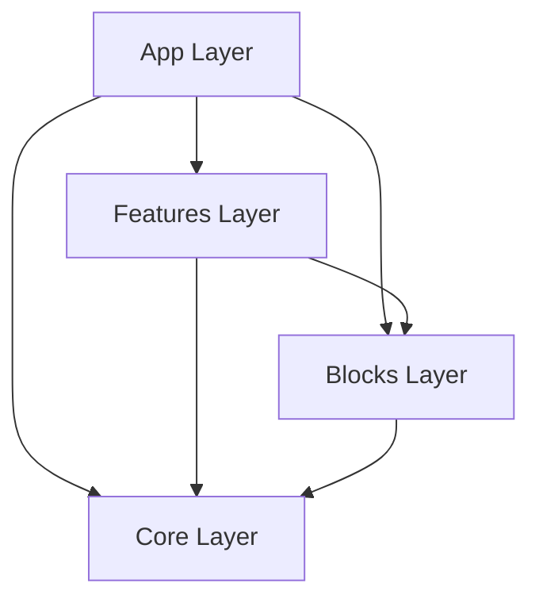

# Architecture

This document governs the layer boundaries and dependency rules of the Gourmetica Platform.

## 1. Layer Ownership Matrix

| Layer | Responsibility | Never Does |
| :--- | :--- | :--- |
| **Core** (`@/core`) | Tokens, primitives, atomic UI, platform services. Pure generic logic. | Contains business logic or domain specific data. |
| **Blocks** (`@/blocks`) | Reusable generic UI assemblies (e.g., HeroBlock, LogoCloud). | Data fetching or state management. |
| **Features** (`@/features`) | Business logic, content orchestration, data repositories. | Reimplement UI primitives or generic tokens. |
| **App** (`app/`) | Routing, composition, and URL state. | Contains business logic or heavy UI implementation. |

## 2. Dependency Flow Rules
Dependencies must only flow **downwards**.

### ✅ Allowed Imports
- `app/page.tsx` importing from `@/features/home`.
- `features/home` importing from `@/blocks/hero`.
- `blocks/hero` importing from `@/core/typography`.

### ❌ Forbidden Imports
- **Sideways:** `features/home` importing from `features/services`. (Features must remain completely encapsulated).
- **Upwards:** `core/components/Button` importing from `@/features/...` or `@/blocks/...`.
- **Skip Encapsulation:** `app/page.tsx` deep importing from `features/home/components/LocalHero` instead of `features/home`.

## 3. The Feature Contract
Every domain in `features/` MUST expose a single `index.ts` file acting as its public API. Other domains or the App layer may only import from this contract.
